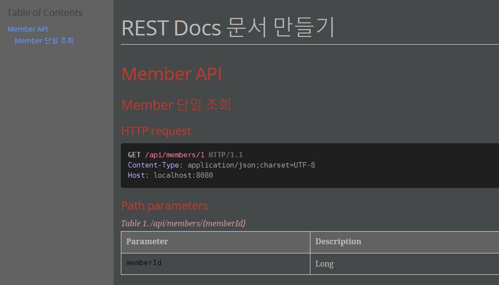
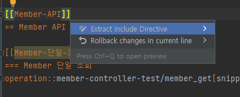
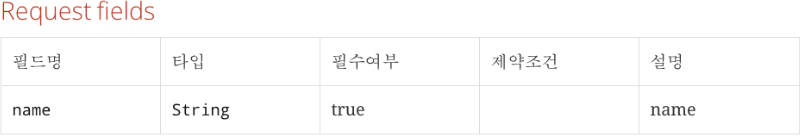
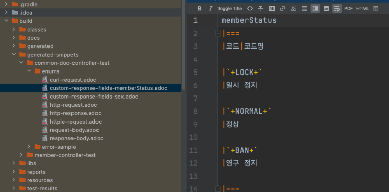
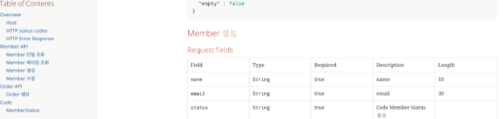
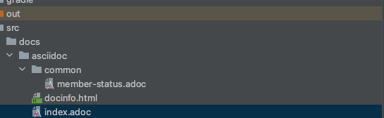
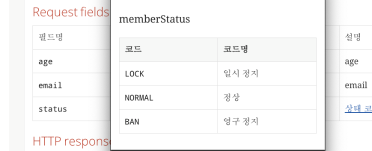
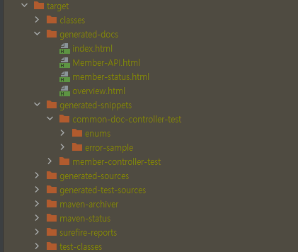
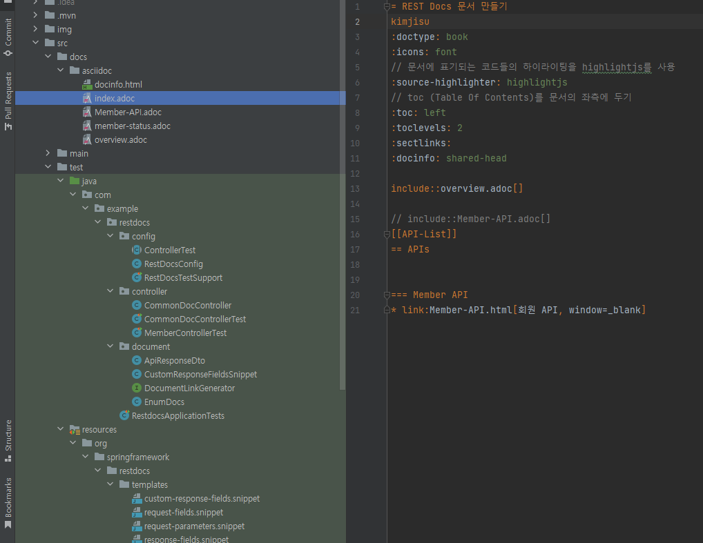
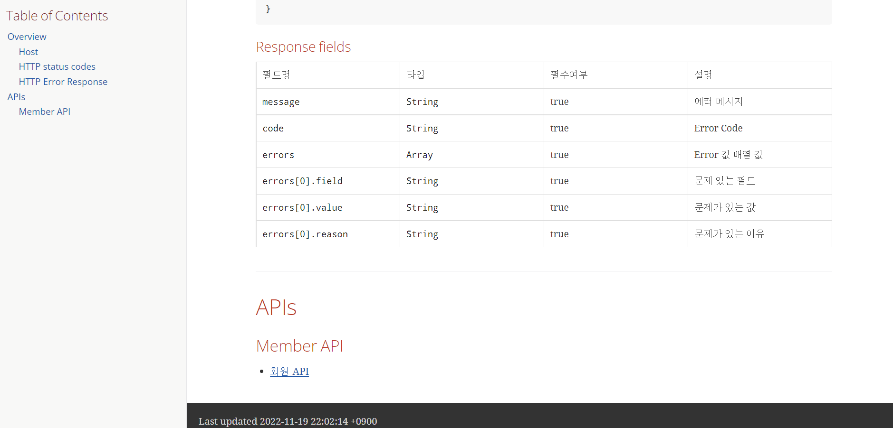

# REST Docs

예제코드는 깃 레포지토리에서 클론했을때 바로 확인 할 수 있도록 만들어져 있습니다.

## 1. REST Docs 란?

+ 테스트 코드 기반으로 Restful API 문서를 돕는 도구입니다.
+ Asciidoctor를 이용해서 HTML 등등 다양한 포맷으로 문서를 자동으로 출력할 수 있습니다.
+ RestDocs의 가장 큰 장점은 테스트 코드 기반으로 문서를 작성한다는 점입니다.
+ API Spec과 문서화를 위한 테스트 코드가 일치하지 않으면 테스트 빌드를 실패하게 되어 테스트 코드로 검증된 문서를 보장할 수 있습니다.

## 2. Swagger VS REST Docs

보통 Spring 에서 문서화를 할 때, Swagger과 Restdocs를 사용하게 됩니다.  
Swagger는 마치 Postman처럼(직접 요청하듯이) API를 테스트해 볼 수 있는 화면을 제공하여 동작 테스트하는 용도에 조금 더 특화되어있습니다.  
그렇다면 Swagger는 문서화도 되고 테스트도 가능하니 더 좋은 것이 아닌가라고 생각할 수 있습니다.  
하지만 Swagger를 사용할 경우 명확한 단점이 존재합니다.

1) 로직에 애노테이션을 통해 명세를 작성하게 되는데 지속적으로 사용하게 된다면 명세를 위한 코드들이 많이 붙게되어 전체적으로 가독성이 떨어진다.
2) 테스트 기반이 아니기에 문서가 100% 정확하다고 확신할 수 없다.
3) 모든 오류에 대한 여러 가지 응답을 문서화할 수 없다.

```
// swagger 예시
public class SignupForm {

    @ApiModelProperty(value = "카카오 id", required = true, example = "1")
    private Long id;

    @ApiModelProperty(value = "카카오 image url", required = true, example = "\"http://k.kakaocdn.net\"")
    private String imageFileUrl;
}
```

반면에 REST Docs를 사용하면 다음과 같은 이점이 있습니다.

1) 테스트 기반으로 문서가 작성되어 테스트 코드가 일치하지 않으면 테스트 빌드가 실패하게 되기 때문에 문서를 신뢰할 수 있다.
2) 테스트 코드에서 명세를 작성하기 때문에 비즈니스 로직의 가독성에 영향을 미치지 않는다.

## 3. 프로젝트 구성

### Maven
Maven -> 프로젝트명 -> Lifecycle -> clean -> package
<details>  
<summary>pom.xml 전체 코드 보기</summary>  
<div markdown="1">    

```  
    <?xml version="1.0" encoding="UTF-8"?>
<project xmlns="http://maven.apache.org/POM/4.0.0" xmlns:xsi="http://www.w3.org/2001/XMLSchema-instance"
         xsi:schemaLocation="http://maven.apache.org/POM/4.0.0 https://maven.apache.org/xsd/maven-4.0.0.xsd">
    <modelVersion>4.0.0</modelVersion>
    <parent>
        <groupId>org.springframework.boot</groupId>
        <artifactId>spring-boot-starter-parent</artifactId>
        <version>2.7.5</version>
        <relativePath/> <!-- lookup parent from repository -->
    </parent>
    <groupId>com.example</groupId>
    <artifactId>restdocs</artifactId>
    <version>0.0.1-SNAPSHOT</version>
    <name>restdocs</name>
    <description>restdocs</description>
    <properties>
        <java.version>11</java.version>
    </properties>
    <dependencies>
        <dependency>
            <groupId>org.springframework.boot</groupId>
            <artifactId>spring-boot-starter-actuator</artifactId>
        </dependency>
        <dependency>
            <groupId>org.springframework.boot</groupId>
            <artifactId>spring-boot-starter-data-jpa</artifactId>
        </dependency>
        <dependency>
            <groupId>org.springframework.boot</groupId>
            <artifactId>spring-boot-starter-web</artifactId>
        </dependency>
        <dependency>
            <groupId>com.h2database</groupId>
            <artifactId>h2</artifactId>
            <scope>runtime</scope>
        </dependency>
        <dependency>
            <groupId>org.projectlombok</groupId>
            <artifactId>lombok</artifactId>
            <optional>true</optional>
        </dependency>
        <dependency>
            <groupId>org.springframework.boot</groupId>
            <artifactId>spring-boot-starter-test</artifactId>
            <scope>test</scope>
        </dependency>
        <!-- (1) Test scope RestDocs MockMvc 를 추가합니다.-->
        <!-- Rest docs -->
        <dependency>
            <groupId>org.springframework.restdocs</groupId>
            <artifactId>spring-restdocs-mockmvc</artifactId>
            <scope>test</scope>
        </dependency>

    </dependencies>

    <build>
        <plugins>
            <plugin>
                <groupId>org.springframework.boot</groupId>
                <artifactId>spring-boot-maven-plugin</artifactId>
                <configuration>
                    <excludes>
                        <exclude>
                            <groupId>org.projectlombok</groupId>
                            <artifactId>lombok</artifactId>
                        </exclude>
                    </excludes>
                </configuration>
            </plugin>
            <!-- REST DOCS -->
            <!-- asciidoctor 플러그인 추가 -->
            <!-- (2) -->
            <plugin>
                <groupId>org.asciidoctor</groupId>
                <artifactId>asciidoctor-maven-plugin</artifactId>
                <version>2.2.2</version>
                <executions>
                    <execution>
                        <id>generate-docs</id>
                        <!-- (3) prepare-package 옵션은 패키지내에 API 문서를 포함할 수 있게 합니다.-->
                        <phase>prepare-package</phase>
                        <goals>
                            <goal>process-asciidoc</goal>
                        </goals>
                        <configuration>
                            <backend>html</backend>
                            <doctype>book</doctype>
                        </configuration>
                    </execution>
                </executions>
                <dependencies>
                    <!-- (4) Asciidoctor 의존성으로 spring-restdocs-asciidoctor 추가 .adoc 파일이 target/generated-snippets 아래에 생성된 Snippets 을 가리키는 설정이 추가된다.-->
                    <dependency>
                        <groupId>org.springframework.restdocs</groupId>
                        <artifactId>spring-restdocs-asciidoctor</artifactId>
                        <version>2.0.4.RELEASE</version>
                    </dependency>
                </dependencies>
            </plugin>
            <!-- (5) 문서가 패키지로 복사되기 전에 생성되야 하므로 위에 Asciidoctor 플러그인 뒤에 선언합니다. -->
            <plugin>
                <groupId>org.apache.maven.plugins</groupId>
                <artifactId>maven-resources-plugin</artifactId>
                <version>3.2.0</version>
                <executions>
                    <execution>
                        <id>copy-resources</id>
                        <phase>prepare-package</phase>
                        <goals>
                            <goal>copy-resources</goal>
                        </goals>
                        <configuration>
                            <!-- (6) generated-docs/index.html 파일을 static/docs 에 복사-->
                            <outputDirectory>
                                ${basedir}/src/main/resources/static/docs
                            </outputDirectory>
                            <resources>
                                <resource>
                                    <directory>
                                        ${project.build.directory}/generated-docs
                                    </directory>
                                </resource>
                            </resources>
                        </configuration>
                    </execution>
                </executions>
            </plugin>
        </plugins>
    </build>

</project>

```   
1) Test scope RestDocs MockMvc를 추가합니다.  
2) asciidoctor 플러그인을 추가합니다.  
3) prepare-package 옵션은 패키지내에 API 문서를 포함할 수 있게 합니다.  
4) asciidoctor의 의존성으로 spring-restdocs-asciidoctor 추가 .adoc 파일이 target/generated-snippets 아래에 생성된 Snippets 을 가리키는 설정이 추가된다.
5) 문서가 패키지로 복사되기 전에 생성되야 하므로 위에 Asciidoctor 플러그인 뒤에 선언합니다.  
6) generated-docs/index.html을 static/docs 에 복사
</div>
</details>

### Gradle

gradle -> 프로젝트명 -> Tasks -> build
<details>  
<summary>build.gradle 전체 코드 보기</summary>  
<div markdown="1">

```java
plugins {
	id 'java'
	id 'org.springframework.boot' version '2.6.9'
	id 'io.spring.dependency-management' version '1.0.11.RELEASE'
	id "org.asciidoctor.jvm.convert" version "3.3.2"
}

group = 'com.example'
version = '0.0.1-SNAPSHOT'
sourceCompatibility = '11'

configurations {
	compileOnly {
		extendsFrom annotationProcessor
	}

	asciidoctorExt
}

repositories {
	mavenCentral()
}

ext {
	asciidocVersion = "2.0.6.RELEASE"
	snippetsDir = file('build/generated-snippets') //문서 저장 위치
}

dependencies {
	implementation 'org.springframework.boot:spring-boot-starter-data-jpa'
	implementation 'org.springframework.boot:spring-boot-starter-web'
    
    asciidoctorExt "org.springframework.restdocs:spring-restdocs-asciidoctor:${asciidocVersion}"
    testImplementation "org.springframework.restdocs:spring-restdocs-mockmvc:${asciidocVersion}"    
	
    compileOnly 'org.projectlombok:lombok'
	runtimeOnly 'com.h2database:h2'
	annotationProcessor 'org.projectlombok:lombok'
	testImplementation 'org.springframework.boot:spring-boot-starter-test'
}

tasks.named('test') {
	useJUnitPlatform()
}

test {
	outputs.dir snippetsDir
}

asciidoctor {
	inputs.dir snippetsDir
	configurations 'asciidoctorExt'
	dependsOn test
}

bootJar {
	dependsOn asciidoctor
    //패키징 위치
	copy {
		from asciidoctor.outputDir
		into "src/main/resources/static/docs"
	}
}
```

</div>
</details>

## 테스트 코드 작성
간단하게 PathVariable을 통해 멤버 정보를 반환하는 테스트를 작성해보겠습니다.

```java
@Getter
@NoArgsConstructor(access = AccessLevel.PROTECTED)
@Entity
public class Member {

    @Id
    @GeneratedValue(strategy = GenerationType.IDENTITY)
    private Long id;

    @Column(name = "email", nullable = false, unique = true)
    private String email;

    @Column(name = "name", nullable = false)
    private String name;
    //생성자 및 다른 코드 생략 
}
```
```
// import문을 확인 필수! 
import static org.springframework.restdocs.mockmvc.MockMvcRestDocumentation.document;
        import static org.springframework.restdocs.mockmvc.RestDocumentationRequestBuilders.get;
        import static org.springframework.restdocs.payload.PayloadDocumentation.fieldWithPath;
        import static org.springframework.restdocs.payload.PayloadDocumentation.responseFields;
        import static org.springframework.restdocs.request.RequestDocumentation.parameterWithName;
        import static org.springframework.restdocs.request.RequestDocumentation.pathParameters;
        import static org.springframework.test.web.servlet.result.MockMvcResultHandlers.print;
        import static org.springframework.test.web.servlet.result.MockMvcResultMatchers.status;

@SpringBootTest
@AutoConfigureMockMvc
@AutoConfigureRestDocs // rest docs 자동 설정
class MemberControllerTest  {

    @Autowired
    private MockMvc mvc;

    @Autowired
    private ObjectMapper objectMapper;
    @MockBean
    private MemberService memberService;

    @Test
    void member_get() throws Exception {
    //given
    Member member = Member.builder().id(1L).email("jisu@naver.com").name("김지수").build();
    given(memberService.getMember(anyLong())).willReturn(member);
    
    //when&then
    mvc.perform(
                get("/api/members/{memberId}", 1L)
                        .contentType(MediaType.APPLICATION_JSON)
            )
            .andExpect(status().isOk())
            .andDo( // rest docs 문서 작성 시작
                    document("member-get", // 문서 조각 디렉토리 명
                            pathParameters( // path 파라미터 정보 입력
                                    parameterWithName("memberId").description("memberId")
                            ),
                            responseFields( // response 필드 정보 입력
                                    fieldWithPath("id").description("ID"),
                                    fieldWithPath("email").description("email"),
                                    fieldWithPath("name").description("name")
                            )
                    )
            );
    }
}
```

위의 테스트 코드가 통과 된후 maven clean package를 하면 target/generated-sinppets 하위 폴더에 member-get이라는 이름으로 조각들이 생성됩니다.  
기본적으로 다음과 같은 조각들이 default로 생성됩니다.  
+ curl-request.adoc  
+ http-request.adoc  
+ httpie-request.adoc  
+ http-response.adoc  
+ request body  
+ response body  

테스트 코드에 따라 추가적인 조각이 생성될 수 있습니다.

+ response-fields.adoc  
+ request-parameters.adoc  
+ request-parts.adoc  
+ path-parameters.adoc  
+ request-parts.adoc  

테스트로 만들어준 조각파일들을 이용해서 문서를 만들 차례입니다.  
우선 main/resources/static/docs 디렉토리를 만들어줍니다. 앞서 maven에서 설정에 의해 이곳으로 html 파일이 복사되어 이곳으로 옮겨집니다.  
그리고 src/docs/asciidoc 디렉토리를 만들고 안에 index.adoc 파일을 만들어줍니다.

```java
= REST Docs 문서 만들기 예제 
https://github.com/jisu3316(부제)
:doctype: book
:icons: font
// 문서에 표기되는 코드들의 하이라이팅을 highlightjs를 사용
:source-highlighter: highlightjs
// toc (Table Of Contents)를 문서의 좌측에 두기        
:toc: left 
:toclevels: 2
:sectlinks:

[[Member-API]]
== Member API

[[Member-단일-조회]]
=== Member 단일 조회
operation::member-get[snippets='http-request,path-parameters,http-response,response-fields']
```

+ :source-highlighter: highlightjs  
문서에 표기되는 코드들의 하이라이팅을 highlightjs를 사용합니다.  
+ :toc: left  
toc (Table Of Contents)를 문서의 좌측에 둡니다.  
+ =, ==, ===   
글씨 크기를 조절합니다.
+ [[텍스트]]  
해당 텍스트에 링크를 겁니다.  
+ operation::디렉토리명[snippets=’원하는 조각들’]  
문서로 사용할 조각들을 명시해줍니다.  
+ include::{snippets}/member-get/XXX.adoc[]  
opertaion의 경우 한번에 원하는 조각들을 넣을 수 있었는데 include는 특정 adoc을 지정하여 넣을 수 있습니다.
 
  
다시 빌드하면 main/resources/static/docs 폴더에 index.html 파일이 만들어지게 됩니다.



인텔리제이의 도움을 받아 문서를 확인해보면 잘 만들어진 것을 확인할 수 있습니다.

### 문서 분리하기
문서화 작업이 많아지면 index.adoc 파일이 매우 길어질 수 있습니다.  
  
인텔리제이에서 Member-API에 대고 알트 + 엔터를 눌러 include 시켜줍니다.

  
src/docs/asciidoc 위치로 해당 API를 뺴주게 됩니다.  

  
그럼 index.adoc 파일이 위와 같이 깔끔하게 정리됩니다.

## 문서 커스텀하기  

  
지금까지 만든 문서를 보면 Type, Description과 같은 필드만 명시되어 있습니다.  
추가적으로 필수여부, 제약조건 등의 정보를 명시해줘야 하는 경우 snippets를 커스텀해줘야 합니다.  


  
커스텀하기 위해서는 src/test/resources/org/springframework/restdocs/templates 경로에 커스텀한 snippets을 만들어주면 됩니다.  
템플릿 코드는 블로그에 작성했더니 깨지는 현상이 발생하여 깃허브를 참고해주시면 좋을 것 같습니다.  
snippet은 mustache 문법을 사용합니다.  
snippet 코드를 보시면 name과 path가 보입니다. test에서 문서 작성시 parameterWithName, fieldWithPath 등을 사용하게 되는데 여기서의 name, path 가 위에서 {{}}안에 값입니다.  
request-field.snippet에는 직접 커스텀한 constraints를 추가해주었습니다. 이는 추후 테스트 코드에서 사용합니다.  

  
이제 다시 빌드해주고 문서를 확인하면 위와 같이 적용된 것을 확인할 수 있습니다.  

## 테스트코드 리팩토링

리팩토링 할 내용은 다음과 같습니다.

1) 테스트 코드에서 andDo(document()) 부분에서 문서명을 항상 지정해줘야 하는 점  
2) 테스트 코드로 인해 build/generated-snippets에 생성된 파일 내용들을 보면 json 포멧이 한줄로 작성되어 보기 매우 불편한 점  
3) 관례상 andDo(print()) 를 모두 붙이는데 이 코드가 중복된다는 점

test 디렉토리에서 RestDocsTestSupport, RestDocsConfig 클래스를 생성하여 위의 문제들을 해결하겠습니다.  
  

RestDocsConfig  

```java
package com.example.restdocs.config;

import org.springframework.boot.test.context.TestConfiguration;
import org.springframework.context.annotation.Bean;
import org.springframework.restdocs.mockmvc.MockMvcRestDocumentation;
import org.springframework.restdocs.mockmvc.RestDocumentationResultHandler;
import org.springframework.restdocs.operation.preprocess.Preprocessors;

import static org.springframework.restdocs.snippet.Attributes.Attribute;

@TestConfiguration
public class RestDocsConfig {

    @Bean
    public RestDocumentationResultHandler write(){
        return MockMvcRestDocumentation.document(
                "{class-name}/{method-name}",
                Preprocessors.preprocessRequest(Preprocessors.prettyPrint()),
                Preprocessors.preprocessResponse(Preprocessors.prettyPrint())
        );
    }

    public static Attribute field(
            final String key,
            final String value){
        return new Attribute(key,value);
    }
}

```

1) “{class-name}/{method-name}”  
+ 1번을 해결한 코드입니다.
+ 조각이 생성되는 디렉토리 명을 클래스명/메서드 명으로 정합니다.
2) prettyPrint
+ 2번을 해결한 코드입니다.
+ json이 한 줄로 출력되던 내용을 pretty 하게 찍어줍니다.
3) Attribute field 메서드
+ rest docs에서 기본적으로 문서작성에 필요한 optional(필수값여부), description(설명) 같은 체이닝 메서드는 제공하지만 제약조건 같이 커스텀으로 작성하는 내용에 대한 기능은 없습니다.
+ 따라서 Attribute를 이용해 key, value 값으로 넣어주기 위한 함수입니다.

ControllerTest.java

```java
package com.example.restdocs.support;

import com.example.restdocs.controller.MemberController;
import com.example.restdocs.service.MemberService;
import com.fasterxml.jackson.core.JsonProcessingException;
import com.fasterxml.jackson.databind.ObjectMapper;
import org.junit.jupiter.api.Disabled;
import org.springframework.beans.factory.annotation.Autowired;
import org.springframework.boot.test.autoconfigure.web.servlet.WebMvcTest;
import org.springframework.boot.test.mock.mockito.MockBean;
import org.springframework.test.web.servlet.MockMvc;

@Disabled
@WebMvcTest({MemberController.class})
public abstract class ControllerTest {

    @Autowired protected ObjectMapper objectMapper;

    @Autowired protected MockMvc mockMvc;

    @MockBean protected MemberService memberService;

    protected String createJson(Object dto) throws JsonProcessingException {
        return objectMapper.writeValueAsString(dto);
    }
}
```
RestDocsTestSupport.java

```java
package com.example.restdocs.support.docs;

import com.example.restdocs.config.RestDocsConfig;
import com.example.restdocs.support.ControllerTest;
import org.junit.jupiter.api.BeforeEach;
import org.junit.jupiter.api.Disabled;
import org.junit.jupiter.api.extension.ExtendWith;
import org.springframework.beans.factory.annotation.Autowired;
import org.springframework.context.annotation.Import;
import org.springframework.restdocs.RestDocumentationContextProvider;
import org.springframework.restdocs.RestDocumentationExtension;
import org.springframework.restdocs.mockmvc.MockMvcRestDocumentation;
import org.springframework.restdocs.mockmvc.RestDocumentationResultHandler;
import org.springframework.test.web.servlet.result.MockMvcResultHandlers;
import org.springframework.test.web.servlet.setup.MockMvcBuilders;
import org.springframework.web.context.WebApplicationContext;
import org.springframework.web.filter.CharacterEncodingFilter;

@Disabled
@Import(RestDocsConfig.class)
@ExtendWith(RestDocumentationExtension.class)
public class RestDocsTestSupport extends ControllerTest {

    @Autowired
    protected RestDocumentationResultHandler restDocs;

    @BeforeEach
    void setUp(final WebApplicationContext context,
               final RestDocumentationContextProvider provider) {
        this.mockMvc = MockMvcBuilders.webAppContextSetup(context)
                .apply(MockMvcRestDocumentation.documentationConfiguration(provider))  // rest docs 설정 주입
                .alwaysDo(MockMvcResultHandlers.print()) // andDo(print()) 코드 포함 -> 3번 문제 해결
                .alwaysDo(restDocs) // pretty 패턴과 문서 디렉토리 명 정해준것 적용
                .addFilters(new CharacterEncodingFilter("UTF-8", true)) // 한글 깨짐 방지
                .build();
    }
}
```
1) @ExtendWith(RestDocumentationExtension.class)
+ 앞선 코드에서는 @AutoConfigureRestDocs로 자동으로 주입시켰지만, 이제 중복 작업을 제거하기 위해서는 직접 MockMvc를 커스텀해서 주입해야합니다.
+ 따라서 자동 주입이 아니라 필요한 것들을 가져와서 주입하기 위해 사용하는 코드입니다.
2) @Import(RestDocsConfig.class)
+ 앞서 작성한 Config를 추가해주는 코드입니다.

이를 바탕으로 optional과 커스텀해서 넣은 constraints를 명시해서 테스트를 작성해보겠습니다.

```java
class MemberControllerTest extends RestDocsTestSupport {
    @DisplayName("v2 멤버 저장")
    @Test
    void save() throws Exception {
        mockMvc.perform(post("/api/members")
                        .contentType(MediaType.APPLICATION_JSON)
                        .content(objectMapper.writeValueAsBytes(memberCreateForm()))
                ).andExpect(status().isOk())
                .andDo(
                        // rest docs 문서 작성 시작
                        restDocs.document(
                                requestFields(
                                        fieldWithPath("email").description("email").attributes(field("constraints", "길이 30 이하")),
                                        fieldWithPath("name").description("name").attributes(field("constraints", "길이 10 이하"))
                                )
                        )
                )
                .andDo(print());
    }

    @DisplayName("v2 단일 멤버 조회")
    @Test
    void member_get() throws Exception {
        Member member = Member.builder().id(1L).email("jisu@naver.com").name("김지수").build();
        given(memberService.getMember(anyLong())).willReturn(member);
        // 조회 API -> 대상의 데이터가 있어야 합니다.
        mockMvc.perform(
                        get("/api/members/{memberId}", 1L)
                                .contentType(MediaType.APPLICATION_JSON)
                )
                .andExpect(status().isOk())
                .andDo( // rest docs 문서 작성 시작
                        restDocs.document(
                                pathParameters( // path 파라미터 정보 입력
                                        parameterWithName("memberId").optional().description("Long")
                                ),
                                responseFields( // response 필드 정보 입력
                                        fieldWithPath("id").description("ID"),
                                        fieldWithPath("email").description("email"),
                                        fieldWithPath("name").description("name")
                                )
                        )
                );
    }
}
```

  

빌드해서 보면 이렇게 잘 나오는것을 확인할 수 있습니다.

## enum 코드 문서화

문서 작성 시 사용되는 타입에 enum이 없기 때문에 enum인 경우 따로 만들어야 합니다.
Member의 Status와 Sex Enum 값을 문서화 진행해보겠습니다.

```java
public interface EnumType {
    String getName();
    String getDescription();
}
```
```java
@AllArgsConstructor
public enum MemberStatus implements EnumType {
    LOCK("일시 정지"),
    NORMAL("정상"),
    BAN("영구 정지");

    private final String description;

    @Override
    public String getDescription() {
        return this.description;
    }

    @Override
    public String getName() {
        return this.name();
    }
}
```
```java
@AllArgsConstructor
@Getter
public enum Sex implements EnumType {
    MALE("남자"),
    FEMALE("여자")
    ;

    private String description;

    @Override
    public String getDescription() {
        return this.description;
    }

    @Override
    public String getName() {
        return this.name();
    }
}
```

```java
@Entity
@Table(name = "member")
@NoArgsConstructor(access = AccessLevel.PROTECTED)
@Getter
public class Member {

    @Id
    @GeneratedValue(strategy = GenerationType.IDENTITY)
    private Long id;

    @Column(name = "email", nullable = false, unique = true)
    private String email;

    @Column(name = "age", nullable = false)
    private int age;

    @Enumerated(EnumType.STRING)
    @Column(name = "status", nullable = false)
    private MemberStatus status;

    @Column(name = "sex", nullable = false)
    @Enumerated(EnumType.STRING)
    private Sex sex;

   // ... 생략
}
```

위와 같은 간단한 코드에서 진행합니다.
사용하는 Enum 타입은 반드시 EnumType를 구현하여야 합니다. 문서화 작업시 사용됩니다.

본격적으로 작업을 시작하겠습니다.

1) Test 패키지에 문서화하고자 하는 Enum 값을 반환하는 컨트롤러를 만듭니다.(테스트 패키지에 작성하면 테스트 실행시에만 동작하므로 실제 운영에서는 동작하지 않습니다)  
2) 1번에서 만든 Controller에 대한 테스트 코드 작성하여 snippet 조각들을 추출합니다.
3) 조각을 기반으로 문서를 작성합니다.


패키지 구조는 위와 같습니다.  
test 디렉토리에 document 패키지를 만들었고 이 안에 Enum를 작성하기 위한 클래스들로 구성했습니다.  
resources에는 custom-response-fields.snippet을 추가했습니다.   
템플릿을 따로 만드는 이유는 간단합니다. 기존에 앞서 만들어준 response-fields.snippet이 default로 사용되는데 enum값은 단지 필드명과 설명만 담아주는 문서를 작성하면 되는데 default로 사용되는 템플릿을 사용하면 불필요한 컬럼들이 생기게 되기 때문입니다.

### custom-response-fields.snippet
```java
{{title}}
|===
|코드|코드명

{{#fields}}
|{{#tableCellContent}}`+{{path}}+`{{/tableCellContent}}
|{{#tableCellContent}}{{description}}{{/tableCellContent}}

{{/fields}}
|===
```

### CustomResponseFieldsSnippet.java

```java
public class CustomResponseFieldsSnippet extends AbstractFieldsSnippet {

    public CustomResponseFieldsSnippet(String type, PayloadSubsectionExtractor<?> subsectionExtractor,
                                       List<FieldDescriptor> descriptors, Map<String, Object> attributes,
                                       boolean ignoreUndocumentedFields) {
        super(type, descriptors, attributes, ignoreUndocumentedFields,
                subsectionExtractor);
    }

    @Override
    protected MediaType getContentType(Operation operation) {
        return operation.getResponse().getHeaders().getContentType();
    }

    @Override
    protected byte[] getContent(Operation operation) throws IOException {
        return operation.getResponse().getContent();
    }
}
```
이 클래스는 default 템플릿이 아닌 custom 템플릿을 사용하기 위한 클래스입니다.  
생성자의 인자 중 type을 보고 template에서 맞는 템플릿을 선택해서 동작합니다.  
즉, 방금 만든 custom-response-fields.snippet을 사용하기 위해서는 type의 값으로 “custom-response”를 주면 됩니다.  
여기까지 custom 템플릿과 custome 템플릿을 사용할 수 있도록 하는 클래스를 만들었습니다. 이제 Enum값을 문서화하기 위한 작업을 진행하겠습니다.

### ApiResponseDto.java

```java
@ToString
@Getter
@NoArgsConstructor
@Builder
public class ApiResponseDto<T> {

    private T data;

    private ApiResponseDto(T data){
        this.data=data;
    }

    public static <T> ApiResponseDto<T> of(T data) {
        return new ApiResponseDto<>(data);
    }
}
```

Test 패키지에서 만들 컨트롤러에서 반환값으로 사용하는 클래스입니다.  

### EnumDocs.java

```java
@Getter
@Setter
@Builder
@NoArgsConstructor
@AllArgsConstructor
public class EnumDocs {
    // 문서화하고 싶은 모든 enum값을 명시
    Map<String,String> Sex;
    Map<String,String> memberStatus;
}
```

이 클래스 또한 Test 패키지에서 만들 컨트롤러에서 사용할 클래스입니다.  
문서화하고자 하는 모든 enum값을 명시해줍니다.

### CommonDocController.java

```java
@RestController
@RequestMapping("/test")
public class CommonDocController {

    @GetMapping("/enums")
    public ApiResponseDto<EnumDocs> findEnums() {

        // 문서화 하고 싶은 -> EnumDocs 클래스에 담긴 모든 Enum 값 생성
        Map<String, String> memberStatus = getDocs(MemberStatus.values());
        Map<String, String> sex = getDocs(Sex.values());

        // 전부 담아서 반환 -> 테스트에서는 이걸 꺼내 해석하여 조각을 만들면 된다.
        return ApiResponseDto.of(EnumDocs.builder()
                .memberStatus(memberStatus)
                .Sex(sex)
                .build()
        );
    }

    private Map<String, String> getDocs(EnumType[] enumTypes) {
        return Arrays.stream(enumTypes)
                .collect(Collectors.toMap(EnumType::getName, EnumType::getDescription));
    }
}
```

EnumDocs 클래스에 문서화하고자 명시해놓은 enum값들을 모두 생성해주고, ApiResponseDto에 담아서 반환하는 테스트 코드를 작성합니다.  
이를 바탕으로 만들어진 조각으로 문서화를 진행할 것입니다.

### CommonDocControllerTest.java

```java
// restdocs의 get 이 아님을 주의!!
import static org.springframework.test.web.servlet.request.MockMvcRequestBuilders.get;


class CommonDocControllerTest extends RestDocsTestSupport {

    @Test
    public void enums() throws Exception {
        // 요청
        ResultActions result = this.mockMvc.perform(
                get("/test/enums")
                        .contentType(MediaType.APPLICATION_JSON)
        );

        // 결과값
        MvcResult mvcResult = result.andReturn();

        // 데이터 파싱
        EnumDocs enumDocs = getData(mvcResult);

        // 문서화 진행
        result.andExpect(status().isOk())
                .andDo(restDocs.document(
                        customResponseFields("custom-response", beneathPath("data.memberStatus").withSubsectionId("memberStatus"), // (1)
                                attributes(key("title").value("memberStatus")),
                                enumConvertFieldDescriptor((enumDocs.getMemberStatus()))
                        ),
                        customResponseFields("custom-response", beneathPath("data.sex").withSubsectionId("sex"), 
                                attributes(key("title").value("sex")),
                                enumConvertFieldDescriptor((enumDocs.getSex()))
                        )
                ));
    }

    // 커스텀 템플릿 사용을 위한 함수
    public static CustomResponseFieldsSnippet customResponseFields
                                (String type,
                                 PayloadSubsectionExtractor<?> subsectionExtractor,
                                 Map<String, Object> attributes, FieldDescriptor... descriptors) {
        return new CustomResponseFieldsSnippet(type, subsectionExtractor, Arrays.asList(descriptors), attributes
                , true);
    }

    // Map으로 넘어온 enumValue를 fieldWithPath로 변경하여 리턴
    private static FieldDescriptor[] enumConvertFieldDescriptor(Map<String, String> enumValues) {
        return enumValues.entrySet().stream()
                .map(x -> fieldWithPath(x.getKey()).description(x.getValue()))
                .toArray(FieldDescriptor[]::new);
    }

    // mvc result 데이터 파싱
    private EnumDocs getData(MvcResult result) throws IOException {
        ApiResponseDto<EnumDocs> apiResponseDto = objectMapper
                                                .readValue(result.getResponse().getContentAsByteArray(),
                                                new TypeReference<ApiResponseDto<EnumDocs>>() {}
                                                );
        return apiResponseDto.getData();
    }
}
```

코드의 대략적인 설명은 주석으로 적어두었고, (1)으로 표기한 내용에 대해 설명을 진행하겠습니다.
```java
customResponseFields(
        "custom-response",
        beneathPath("data.memberStatus").withSubsectionId("memberStatus"),
        attributes(key("title").value("memberStatus")),
        enumConvertFieldDescriptor((enumDocs.getMemberStatus()))
```

앞서 작성한 커스텀 템플릿을 사용하도록 하는 코드입니다.  
1) 첫번째 인자 type  
custom-response-fields.snippet 템플릿을 사용할 것이므로 “custom-response” 를 인자로 넘깁니다.  
2) 두번째 인자 subsectionExtractor  
현재 컨트롤러는 요청에 대한 응답으로 ApiResponseDto 객체를 보냅니다.   
앞서 코드에서 반환값으로 ApiResponseDto는 data필드를 가지고 있고 이 데이터 필드 안에 문서화하고자 하는 enum값을 담아서 보냈습니다.  
sex값을 예로 들면, data.sex에 값이 들어있습니다.  
따라서 beneathPath에는 data.memberStatus, withSubsectionId에는 memberStatus를 명시해주면 이에 따라 데이터를 추출합니다.  
3) 세번째 인자 attributes  
속성값을 넣는 곳인데 이 부분은 아래서 볼 문서화 과정에서 보시는게 훨씬 이해하기 편할 것 같습니다.  
4) 네번째 인자 descriptors  
요청에 대한 응답값을 파싱해서 enumDocs를 추출해내면 이 안에는 Map 형태로 enum값들이 들어가 있습니다.  
이 값들을 문서화애 사용하기 위해 enumConvertFieldDescriptor 함수를 만들어 enum값들을 추출하여 FieldDescriptor로 만들어 인자로 넣어줍니다.



이제 빌드를 해주면 위와 같이 조각이 만들어진 것을 확인할 수 있습니다.  
custom-response-fields-memberStatus.adoc 파일을 보시면 attributes(key(“title”).value(“memberStatus”)) 코드로 인해 문서 상단에 memberStatus라는 문자가 들어가게 됩니다.

여기까지 enum 문서화를 끝냈습니다.
하지만 만들어진 조각을 바탕으로 문서화하면 매우 번거롭습니다. 일단 간단하게 문서화를 해놓고 보겠습니다.


표에는 MemberStatus 코드를 참고하여 값을 확인하라고 적혀있습니다.  
그럼 왼쪽 목록에서 해당 링크를 타고 가서 확인해야 합니다. 만약 링크를 타고 이동해서 확인하고 원래 보던 곳으로 다시 되돌아가려면 전에 보고 있던 문서의 지점을 찾기가 어렵습니다.  
따라서 표 안에서 클릭으로 팝업창을 띄울 수 있다면 훨씬 편하게 문서를 확인할 수 있을 것입니다.  

asciidoc에서는 팝업을 제공하지 않아 우회하여 해결해야 합니다.  
asccidoctor의 docinfo 라는 속성이 있는데 adoc 파일에 html 파일을 주입 할 수 있게 해주는 속성 입니다.  

docinfo 는 private, shared, head, footer 등의 조합을 할 수 있습니다.  
private 시 특정 파일 이름을 선언해서 사용 가능합니다.  
shared 선언 시 docinfo.html 을 기본적으로 가져다 사용합니다.  
head 는 private-head 또는 shared-head 로 선언이 가능하며 선언 시 head 위치에 붙습니다.  
footer 는 head 와 반대입니다.  
docinfo1, docinfo2 등등 도 있는데 이것은 alias 입니다.  
그럼 이제 만들어지는 HTML의 a tag 에 class 속성을 넣고 클릭 시 html에 선언한 javascript로 팝업을 띄워보겠습니다.  


패키지 구조는 다음과 같습니다.

### docinfo.html

```java
<script>
    function ready(callbackFunc) {
        if (document.readyState !== 'loading') {
            // Document is already ready, call the callback directly
            callbackFunc();
        } else if (document.addEventListener) {
            // All modern browsers to register DOMContentLoaded
            document.addEventListener('DOMContentLoaded', callbackFunc);
        } else {
            // Old IE browsers
            document.attachEvent('onreadystatechange', function () {
                if (document.readyState === 'complete') {
                    callbackFunc();
                }
            });
        }
    }

    function openPopup(event) {

        const target = event.target;
        if (target.className !== "popup") {
            return;
        }

        event.preventDefault();
        const screenX = event.screenX;
        const screenY = event.screenY;
        window.open(target.href, target.text, `left=${screenX}, top=${screenY}, width=500, height=600, status=no, menubar=no, toolbar=no, resizable=no`);
    }

    ready(function () {
        const el = document.getElementById("content");
        el.addEventListener("click", event => openPopup(event), false);
    });
</script>
```

해당 파일은 기본옵션으로 만들었기 때문에 docinfo.html 이라는 이름이 지정되었고 해당 이름과 경로는 옵션으로 변경 가능합니다.  
각 페이지마다 스타일과 스크립트가 다르다면 옵션으로 만드시고 그게 아니라면 저처럼 하나만 작성하면 됩니다.  

### index.adoc
```java
= REST Docs 문서 만들기 (글의 제목)
backtony.github.io(부제)
:doctype: book
:icons: font
:source-highlighter: highlightjs
:toc: left
:toclevels: 2
:sectlinks:
:docinfo: shared-head

include::Member-API.adoc[]
```
기존 코드에서 docinfo 속성만 추가해줍니다.  

### member-status.adoc
```java
:doctype: book
:icons: font

[[member-status]]
include::{snippets}/common-doc-controller-test/enums/custom-response-fields-memberStatus.adoc[]
```

enum값의 테스트로 만든 조각을 문서화시켜줍니다.  
여기서 [[member-status]]는 HTML로 변환시 div id=”member-status” 가 붙게 됩니다.  

### MemberControllerTest.java
앞서 작성했던 MemberControllerTest를 수정하겠습니다.  
```java
class MemberControllerTest extends RestDocsTestSupport {

    ...

    @Test
    public void member_create() throws Exception {
        MemberSignUpRequest dto = MemberSignUpRequest.builder()
                .age(1)
                .email("hhh@naver.com")
                .status(MemberStatus.BAN)
                .build();
        mockMvc.perform(
                post("/api/members")
                        .contentType(MediaType.APPLICATION_JSON)
                        .content(objectMapper.writeValueAsString(dto))
        )
                .andExpect(status().isOk())
                .andDo(
                        restDocs.document(
                                requestFields(
                                        fieldWithPath("age").description("age").attributes(field("constraints", "길이 10 이하")),
                                        fieldWithPath("email").description("email").attributes(field("constraints", "길이 30 이하")),
                                        fieldWithPath("status").description("link:common/member-status.html[상태 코드,role=\"popup\"]")
                                )
                        )
                )
        ;
    }

    ...
}
```
달라진 점은 fieldWithPath의 description 쪽입니다.  
role은 doc파일을 생성하면 class가 됩니다. HTML로 변환시 아래와 같이 변환됩니다.  
```html
<td class="tableblock halign-left valign-top"><p class="tableblock"><a href="common/member-status.html" class="popup">상태 코드</a></p></td>
```



이제 빌드를 해서 문서를 확인해보면 클릭시 팝업창이 뜨는 것을 확인할 수 있습니다.  
sex 필드에 대해서도 똑같이 진행하면 됩니다.  
끝내 완성은 했지만 popup 코드를 일일이 작성한다는 것은 매우 번거롭습니다.  
따라서 클래스로 따로 만들어 빼서 사용하도록 하겠습니다.  
```html
public interface DocumentLinkGenerator {

    static String generateLinkCode(DocUrl docUrl) {
        return String.format("link:common/%s.html[%s %s,role=\"popup\"]", docUrl.pageId, docUrl.text, "코드");
    }

    static String generateText(DocUrl docUrl) {
        return String.format("%s %s", docUrl.text, "코드명");
    }

    @RequiredArgsConstructor
    enum DocUrl {
        MEMBER_STATUS("member-status", "상태"),
        MEMBER_SEX("sex","성별")
        ;

        private final String pageId;
        @Getter
        private final String text;
    }
}
```

### MemberControllerTest.java
테스트 코드를 DocumentLinkGenerator를 이용해서 수정해줍니다.  
```java
class MemberControllerTest extends RestDocsTestSupport {
    @Test
    public void member_create() throws Exception {
        MemberSignUpRequest dto = MemberSignUpRequest.builder()
                .age(1)
                .email("hhh@naver.com")
                .status(MemberStatus.BAN)
                .build();
        mockMvc.perform(
                post("/api/members")
                        .contentType(MediaType.APPLICATION_JSON)
                        .content(objectMapper.writeValueAsString(dto))
        )
                .andExpect(status().isOk())
                .andDo(
                        restDocs.document(
                                requestFields(
                                        fieldWithPath("age").description("age").attributes(field("constraints", "길이 10 이하")),
                                        fieldWithPath("email").description("email").attributes(field("constraints", "길이 30 이하")),
                                        fieldWithPath("status").description(DocumentLinkGenerator.generateLinkCode(DocumentLinkGenerator.DocUrl.MEMBER_STATUS))
                                )
                        )
                )
        ;
    }
}
```

명시적으로 작성하기 위해 길게 나뒀지만, static import를 이용하면 간단하게 줄여서 사용할 수 있습니다.

## 공통 코드 문서화 Permalink
이제 마지막으로 HTTP Error Response, HTTP status codes, Host 환경 같은 내용을 문서화해보겠습니다.  
에러 관련 문서화 내용이 필요하므로 테스트 패키지에서 에러를 발생시키는 컨트롤러를 만들어주고 테스트를 작성합니다.  

### CommonDocController.java
```java

@RestController
@RequestMapping("/test")
public class CommonDocController {

    @PostMapping("/error")
    public void errorSample(@RequestBody @Valid SampleRequest dto) {
    }

    @Getter
    @Setter
    @AllArgsConstructor
    @NoArgsConstructor
    public static class SampleRequest {

        @NotEmpty
        private String name;

        @Email
        private String email;
    }

    ....

}
```

기존에 있던 CommonDocController 위 코드를 추가합니다.

### CommonDocControllerTest.java

```java
class CommonDocControllerTest extends RestDocsTestSupport {

    @Test
    public void errorSample() throws Exception {
        CommonDocController.SampleRequest sampleRequest = new CommonDocController.SampleRequest("name","hhh.naver");
        mockMvc.perform(
                post("/test/error")
                        .contentType(MediaType.APPLICATION_JSON)
                        .content(objectMapper.writeValueAsString(sampleRequest))
        )
                .andExpect(status().isBadRequest())
                .andDo(
                        restDocs.document(
                                responseFields(
                                        fieldWithPath("message").description("에러 메시지"),
                                        fieldWithPath("code").description("Error Code"),
                                        fieldWithPath("errors").description("Error 값 배열 값"),
                                        fieldWithPath("errors[0].field").description("문제 있는 필드"),
                                        fieldWithPath("errors[0].value").description("문제가 있는 값"),
                                        fieldWithPath("errors[0].reason").description("문재가 있는 이유")
                                )
                        )
                )
        ;
    }

    ...
}
```
기존 CommonDocControllerTest에서 위 코드를 추가해줍니다. 잘못된 email 형식을 넣어 에러가 터지게 합니다.  
다시 한번 빌드해줍니다.  


이제 빌드로 생성된 조각을 이용해서 문서를 작성하겠습니다.  
src/docs/asciidocs 위치에 overview.adoc 를 만들어줍니다.  
### overview.adoc
```java
[[overview]]
== Overview

[[overview-host]]
=== Host

|===
| 환경 | Host

| Beta
| `beta-backtony.github.io`

| Production
| `backtony.github.io`
|===

[[overview-http-status-codes]]
=== HTTP status codes

|===
| 상태 코드 | 설명

| `200 OK`
| 성공

| `400 Bad Request`
| 잘못된 요청

| `401 Unauthorized`
| 비인증 상태

| `403 Forbidden`
| 권한 거부

| `404 Not Found`
| 존재하지 않는 요청 리소스

| `500 Internal Server Error`
| 서버 에러
|===

[[overview-error-response]]
=== HTTP Error Response
operation::common-doc-controller-test/error-sample[snippets='http-response,response-fields']
```

### index.adoc
```java
= REST Docs 문서 만들기 (글의 제목)
backtony.github.io(부제)
:doctype: book
:icons: font
:source-highlighter: highlightjs
:toc: left
:toclevels: 2
:sectlinks:
:docinfo: shared-head

include::overview.adoc[]

include::Member-API.adoc[]
```
기본 index.adoc에 overview.adoc을 추가해줍니다.  
그리고 다시 한번 빌드를 합니다.  

최종적으로 문서가 완성되었습니다.

## 4. 링크로 문서화
현재 한 페이지에서 모든 API를 보여주고 있습니다.  
왼쪽 Table of Content로 바로가기를 할 수는 있지만, 가독성이 너무 떨어지는 것 같은 느낌이 들었습니다.  
각 API마다 링크를 걸어주고 새로운 페이지에서 확인할 수 있도록 하여 가독성을 높여보겠습니다.  

### API별 문서화

각각의 API별로 .adoc 파일로 문서화를 진행합니다.  
  
build를 진행하면 이제 build/docs 폴더 안에 adoc 파일마다 각각의 HTML 파일이 생성됩니다.  

  

index 파일에서는 이제 * link 를 사용하여 각 html 파일명을 적어줍니다. window blank는 새로운 창을 의미합니다.

# 최종 결과

  

  

이제 문서를 확인해보면 각각의 API별로 링크가 들어가 있고 클릭 시 새로운 창이 띄워지게 됩니다.  
이렇게 최종적으로 문서를 완성했습니다.

### ref 
https://docs.spring.io/spring-restdocs/docs/current/reference/html5/  
https://techblog.woowahan.com/2597/  
https://techblog.woowahan.com/2678/
