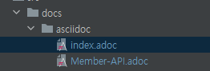
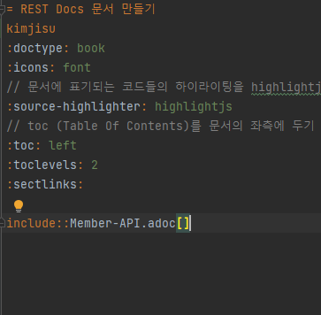
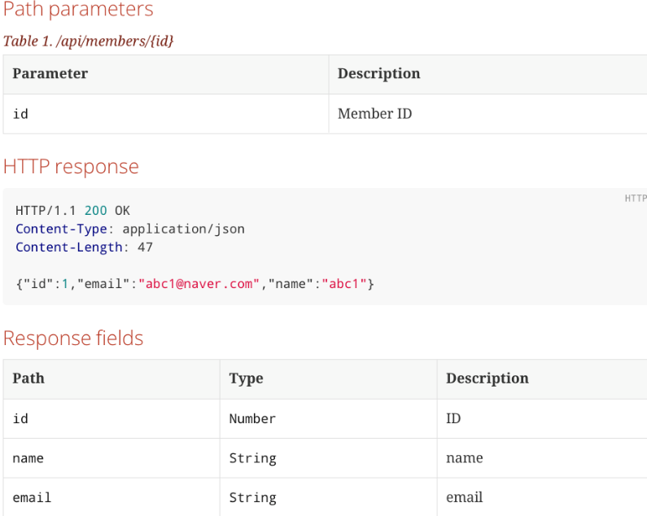
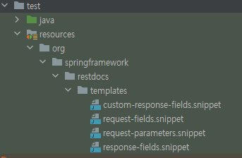
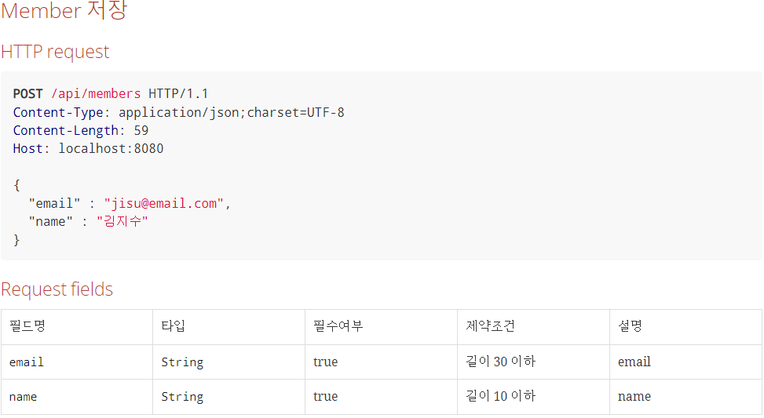

# REST Docs

예제코드는 깃 레포지토리에서 클론했을때 바로 확인 할 수 있도록 만들어져 있습니다.

## 1. REST Docs 란?

+ 테스트 코드 기반으로 Restful API 문서를 돕는 도구입니다.
+ Asciidoctor를 이용해서 HTML 등등 다양한 포맷으로 문서를 자동으로 출력할 수 있습니다.
+ RestDocs의 가장 큰 장점은 테스트 코드 기반으로 문서를 작성한다는 점입니다.
+ API Spec과 문서화를 위한 테스트 코드가 일치하지 않으면 테스트 빌드를 실패하게 되어 테스트 코드로 검증된 문서를 보장할 수 있습니다.

## 2. Swagger VS REST Docs

보통 Spring 에서 문서화를 할 때, Swagger과 Restdocs를 사용하게 됩니다.  
Swagger는 마치 Postman처럼(직접 요청하듯이) API를 테스트해 볼 수 있는 화면을 제공하여 동작 테스트하는 용도에 조금 더 특화되어있습니다.  
그렇다면 Swagger는 문서화도 되고 테스트도 가능하니 더 좋은 것이 아닌가라고 생각할 수 있습니다.  
하지만 Swagger를 사용할 경우 명확한 단점이 존재합니다.

1) 로직에 애노테이션을 통해 명세를 작성하게 되는데 지속적으로 사용하게 된다면 명세를 위한 코드들이 많이 붙게되어 전체적으로 가독성이 떨어진다.
2) 테스트 기반이 아니기에 문서가 100% 정확하다고 확신할 수 없다.
3) 모든 오류에 대한 여러 가지 응답을 문서화할 수 없다.

```
// swagger 예시
public class SignupForm {

    @ApiModelProperty(value = "카카오 id", required = true, example = "1")
    private Long id;

    @ApiModelProperty(value = "카카오 image url", required = true, example = "\"http://k.kakaocdn.net\"")
    private String imageFileUrl;
}
```

반면에 REST Docs를 사용하면 다음과 같은 이점이 있습니다.

1) 테스트 기반으로 문서가 작성되어 테스트 코드가 일치하지 않으면 테스트 빌드가 실패하게 되기 때문에 문서를 신뢰할 수 있다.
2) 테스트 코드에서 명세를 작성하기 때문에 비즈니스 로직의 가독성에 영향을 미치지 않는다.

## 3. 프로젝트 구성

### Maven
Maven -> 프로젝트명 -> Lifecycle -> clean -> package
<details>  
<summary>pom.xml 전체 코드 보기</summary>  
<div markdown="1">    

```  
    <?xml version="1.0" encoding="UTF-8"?>
<project xmlns="http://maven.apache.org/POM/4.0.0" xmlns:xsi="http://www.w3.org/2001/XMLSchema-instance"
         xsi:schemaLocation="http://maven.apache.org/POM/4.0.0 https://maven.apache.org/xsd/maven-4.0.0.xsd">
    <modelVersion>4.0.0</modelVersion>
    <parent>
        <groupId>org.springframework.boot</groupId>
        <artifactId>spring-boot-starter-parent</artifactId>
        <version>2.7.5</version>
        <relativePath/> <!-- lookup parent from repository -->
    </parent>
    <groupId>com.example</groupId>
    <artifactId>restdocs</artifactId>
    <version>0.0.1-SNAPSHOT</version>
    <name>restdocs</name>
    <description>restdocs</description>
    <properties>
        <java.version>11</java.version>
    </properties>
    <dependencies>
        <dependency>
            <groupId>org.springframework.boot</groupId>
            <artifactId>spring-boot-starter-actuator</artifactId>
        </dependency>
        <dependency>
            <groupId>org.springframework.boot</groupId>
            <artifactId>spring-boot-starter-data-jpa</artifactId>
        </dependency>
        <dependency>
            <groupId>org.springframework.boot</groupId>
            <artifactId>spring-boot-starter-web</artifactId>
        </dependency>
        <dependency>
            <groupId>com.h2database</groupId>
            <artifactId>h2</artifactId>
            <scope>runtime</scope>
        </dependency>
        <dependency>
            <groupId>org.projectlombok</groupId>
            <artifactId>lombok</artifactId>
            <optional>true</optional>
        </dependency>
        <dependency>
            <groupId>org.springframework.boot</groupId>
            <artifactId>spring-boot-starter-test</artifactId>
            <scope>test</scope>
        </dependency>
        <!-- (1) Test scope RestDocs MockMvc 를 추가합니다.-->
        <!-- Rest docs -->
        <dependency>
            <groupId>org.springframework.restdocs</groupId>
            <artifactId>spring-restdocs-mockmvc</artifactId>
            <scope>test</scope>
        </dependency>

    </dependencies>

    <build>
        <plugins>
            <plugin>
                <groupId>org.springframework.boot</groupId>
                <artifactId>spring-boot-maven-plugin</artifactId>
                <configuration>
                    <excludes>
                        <exclude>
                            <groupId>org.projectlombok</groupId>
                            <artifactId>lombok</artifactId>
                        </exclude>
                    </excludes>
                </configuration>
            </plugin>
            <!-- REST DOCS -->
            <!-- asciidoctor 플러그인 추가 -->
            <!-- (2) -->
            <plugin>
                <groupId>org.asciidoctor</groupId>
                <artifactId>asciidoctor-maven-plugin</artifactId>
                <version>2.2.2</version>
                <executions>
                    <execution>
                        <id>generate-docs</id>
                        <!-- (3) prepare-package 옵션은 패키지내에 API 문서를 포함할 수 있게 합니다.-->
                        <phase>prepare-package</phase>
                        <goals>
                            <goal>process-asciidoc</goal>
                        </goals>
                        <configuration>
                            <backend>html</backend>
                            <doctype>book</doctype>
                        </configuration>
                    </execution>
                </executions>
                <dependencies>
                    <!-- (4) Asciidoctor 의존성으로 spring-restdocs-asciidoctor 추가 .adoc 파일이 target/generated-snippets 아래에 생성된 Snippets 을 가리키는 설정이 추가된다.-->
                    <dependency>
                        <groupId>org.springframework.restdocs</groupId>
                        <artifactId>spring-restdocs-asciidoctor</artifactId>
                        <version>2.0.4.RELEASE</version>
                    </dependency>
                </dependencies>
            </plugin>
            <!-- (5) 문서가 패키지로 복사되기 전에 생성되야 하므로 위에 Asciidoctor 플러그인 뒤에 선언합니다. -->
            <plugin>
                <groupId>org.apache.maven.plugins</groupId>
                <artifactId>maven-resources-plugin</artifactId>
                <version>3.2.0</version>
                <executions>
                    <execution>
                        <id>copy-resources</id>
                        <phase>prepare-package</phase>
                        <goals>
                            <goal>copy-resources</goal>
                        </goals>
                        <configuration>
                            <!-- (6) generated-docs/index.html 파일을 static/docs 에 복사-->
                            <outputDirectory>
                                ${basedir}/src/main/resources/static/docs
                            </outputDirectory>
                            <resources>
                                <resource>
                                    <directory>
                                        ${project.build.directory}/generated-docs
                                    </directory>
                                </resource>
                            </resources>
                        </configuration>
                    </execution>
                </executions>
            </plugin>
        </plugins>
    </build>

</project>

```   
1) Test scope RestDocs MockMvc를 추가합니다.  
2) asciidoctor 플러그인을 추가합니다.  
3) prepare-package 옵션은 패키지내에 API 문서를 포함할 수 있게 합니다.  
4) asciidoctor의 의존성으로 spring-restdocs-asciidoctor 추가 .adoc 파일이 target/generated-snippets 아래에 생성된 Snippets 을 가리키는 설정이 추가된다.
5) 문서가 패키지로 복사되기 전에 생성되야 하므로 위에 Asciidoctor 플러그인 뒤에 선언합니다.  
6) generated-docs/index.html을 static/docs 에 복사
</div>
</details>

### Gradle

gradle -> 프로젝트명 -> Tasks -> build
<details>  
<summary>build.gradle 전체 코드 보기</summary>  
<div markdown="1">

```java
plugins {
	id 'java'
	id 'org.springframework.boot' version '2.6.9'
	id 'io.spring.dependency-management' version '1.0.11.RELEASE'
	id "org.asciidoctor.jvm.convert" version "3.3.2"
}

group = 'com.example'
version = '0.0.1-SNAPSHOT'
sourceCompatibility = '11'

configurations {
	compileOnly {
		extendsFrom annotationProcessor
	}

	asciidoctorExt
}

repositories {
	mavenCentral()
}

ext {
	asciidocVersion = "2.0.6.RELEASE"
	snippetsDir = file('build/generated-snippets') //문서 저장 위치
}

dependencies {
	implementation 'org.springframework.boot:spring-boot-starter-data-jpa'
	implementation 'org.springframework.boot:spring-boot-starter-web'
    
    asciidoctorExt "org.springframework.restdocs:spring-restdocs-asciidoctor:${asciidocVersion}"
    testImplementation "org.springframework.restdocs:spring-restdocs-mockmvc:${asciidocVersion}"    
	
    compileOnly 'org.projectlombok:lombok'
	runtimeOnly 'com.h2database:h2'
	annotationProcessor 'org.projectlombok:lombok'
	testImplementation 'org.springframework.boot:spring-boot-starter-test'
}

tasks.named('test') {
	useJUnitPlatform()
}

test {
	outputs.dir snippetsDir
}

asciidoctor {
	inputs.dir snippetsDir
	configurations 'asciidoctorExt'
	dependsOn test
}

bootJar {
	dependsOn asciidoctor
    //패키징 위치
	copy {
		from asciidoctor.outputDir
		into "src/main/resources/static/docs"
	}
}
```

</div>
</details>

## 테스트 코드 작성
간단하게 PathVariable을 통해 멤버 정보를 반환하는 테스트를 작성해보겠습니다.

```java
@Getter
@NoArgsConstructor(access = AccessLevel.PROTECTED)
@Entity
public class Member {

    @Id
    @GeneratedValue(strategy = GenerationType.IDENTITY)
    private Long id;

    @Column(name = "email", nullable = false, unique = true)
    private String email;

    @Column(name = "name", nullable = false)
    private String name;
    //생성자 및 다른 코드 생략 
}
```
```
// import문을 확인 필수! 
import static org.springframework.restdocs.mockmvc.MockMvcRestDocumentation.document;
        import static org.springframework.restdocs.mockmvc.RestDocumentationRequestBuilders.get;
        import static org.springframework.restdocs.payload.PayloadDocumentation.fieldWithPath;
        import static org.springframework.restdocs.payload.PayloadDocumentation.responseFields;
        import static org.springframework.restdocs.request.RequestDocumentation.parameterWithName;
        import static org.springframework.restdocs.request.RequestDocumentation.pathParameters;
        import static org.springframework.test.web.servlet.result.MockMvcResultHandlers.print;
        import static org.springframework.test.web.servlet.result.MockMvcResultMatchers.status;

@SpringBootTest
@AutoConfigureMockMvc
@AutoConfigureRestDocs // rest docs 자동 설정
class MemberControllerTest  {

    @Autowired
    private MockMvc mvc;

    @Autowired
    private ObjectMapper objectMapper;
    @MockBean
    private MemberService memberService;

    @Test
    void member_get() throws Exception {
    //given
    Member member = Member.builder().id(1L).email("jisu@naver.com").name("김지수").build();
    given(memberService.getMember(anyLong())).willReturn(member);
    
    //when&then
    mvc.perform(
                get("/api/members/{memberId}", 1L)
                        .contentType(MediaType.APPLICATION_JSON)
            )
            .andExpect(status().isOk())
            .andDo( // rest docs 문서 작성 시작
                    document("member-get", // 문서 조각 디렉토리 명
                            pathParameters( // path 파라미터 정보 입력
                                    parameterWithName("memberId").description("memberId")
                            ),
                            responseFields( // response 필드 정보 입력
                                    fieldWithPath("id").description("ID"),
                                    fieldWithPath("email").description("email"),
                                    fieldWithPath("name").description("name")
                            )
                    )
            );
    }
}
```

위의 테스트 코드가 통과 된후 maven clean package를 하면 target/generated-sinppets 하위 폴더에 member-get이라는 이름으로 조각들이 생성됩니다.  
기본적으로 다음과 같은 조각들이 default로 생성됩니다.  
+ curl-request.adoc  
+ http-request.adoc  
+ httpie-request.adoc  
+ http-response.adoc  
+ request body  
+ response body  

테스트 코드에 따라 추가적인 조각이 생성될 수 있습니다.

+ response-fields.adoc  
+ request-parameters.adoc  
+ request-parts.adoc  
+ path-parameters.adoc  
+ request-parts.adoc  

테스트로 만들어준 조각파일들을 이용해서 문서를 만들 차례입니다.  
우선 main/resources/static/docs 디렉토리를 만들어줍니다. 앞서 maven에서 설정에 의해 이곳으로 html 파일이 복사되어 이곳으로 옮겨집니다.  
그리고 src/docs/asciidoc 디렉토리를 만들고 안에 index.adoc 파일을 만들어줍니다.

```java
= REST Docs 문서 만들기 예제 
https://github.com/jisu3316(부제)
:doctype: book
:icons: font
// 문서에 표기되는 코드들의 하이라이팅을 highlightjs를 사용
:source-highlighter: highlightjs
// toc (Table Of Contents)를 문서의 좌측에 두기        
:toc: left 
:toclevels: 2
:sectlinks:

[[Member-API]]
== Member API

[[Member-단일-조회]]
=== Member 단일 조회
operation::member-get[snippets='http-request,path-parameters,http-response,response-fields']
```

+ :source-highlighter: highlightjs  
문서에 표기되는 코드들의 하이라이팅을 highlightjs를 사용합니다.  
+ :toc: left  
toc (Table Of Contents)를 문서의 좌측에 둡니다.  
+ =, ==, ===   
글씨 크기를 조절합니다.
+ [[텍스트]]  
해당 텍스트에 링크를 겁니다.  
+ operation::디렉토리명[snippets=’원하는 조각들’]  
문서로 사용할 조각들을 명시해줍니다.  
+ include::{snippets}/member-get/XXX.adoc[]  
opertaion의 경우 한번에 원하는 조각들을 넣을 수 있었는데 include는 특정 adoc을 지정하여 넣을 수 있습니다.
 
  
다시 빌드하면 main/resources/static/docs 폴더에 index.html 파일이 만들어지게 됩니다.

  
인텔리제이의 도움을 받아 문서를 확인해보면 잘 만들어진 것을 확인할 수 있습니다.

### 문서 분리하기
문서화 작업이 많아지면 index.adoc 파일이 매우 길어질 수 있습니다.  
  
인텔리제이에서 Member-API에 대고 알트 + 엔터를 눌러 include 시켜줍니다.

  
src/docs/asciidoc 위치로 해당 API를 뺴주게 됩니다.  

  
그럼 index.adoc 파일이 위와 같이 깔끔하게 정리됩니다.

## 문서 커스텀하기  

  
지금까지 만든 문서를 보면 Type, Description과 같은 필드만 명시되어 있습니다.  
추가적으로 필수여부, 제약조건 등의 정보를 명시해줘야 하는 경우 snippets를 커스텀해줘야 합니다.  


  
커스텀하기 위해서는 src/test/resources/org/springframework/restdocs/templates 경로에 커스텀한 snippets을 만들어주면 됩니다.  
템플릿 코드는 블로그에 작성했더니 깨지는 현상이 발생하여 깃허브를 참고해주시면 좋을 것 같습니다.  
snippet은 mustache 문법을 사용합니다.  
snippet 코드를 보시면 name과 path가 보입니다. test에서 문서 작성시 parameterWithName, fieldWithPath 등을 사용하게 되는데 여기서의 name, path 가 위에서 {{}}안에 값입니다.  
request-field.snippet에는 직접 커스텀한 constraints를 추가해주었습니다. 이는 추후 테스트 코드에서 사용합니다.  

  
이제 다시 빌드해주고 문서를 확인하면 위와 같이 적용된 것을 확인할 수 있습니다.  

## 테스트코드 리팩토링

리팩토링 할 내용은 다음과 같습니다.

1) 테스트 코드에서 andDo(document()) 부분에서 문서명을 항상 지정해줘야 하는 점  
2) 테스트 코드로 인해 build/generated-snippets에 생성된 파일 내용들을 보면 json 포멧이 한줄로 작성되어 보기 매우 불편한 점  
3) 관례상 andDo(print()) 를 모두 붙이는데 이 코드가 중복된다는 점

test 디렉토리에서 RestDocsTestSupport, RestDocsConfig 클래스를 생성하여 위의 문제들을 해결하겠습니다.  
  

RestDocsConfig  

```java
package com.example.restdocs.config;

import org.springframework.boot.test.context.TestConfiguration;
import org.springframework.context.annotation.Bean;
import org.springframework.restdocs.mockmvc.MockMvcRestDocumentation;
import org.springframework.restdocs.mockmvc.RestDocumentationResultHandler;
import org.springframework.restdocs.operation.preprocess.Preprocessors;

import static org.springframework.restdocs.snippet.Attributes.Attribute;

@TestConfiguration
public class RestDocsConfig {

    @Bean
    public RestDocumentationResultHandler write(){
        return MockMvcRestDocumentation.document(
                "{class-name}/{method-name}",
                Preprocessors.preprocessRequest(Preprocessors.prettyPrint()),
                Preprocessors.preprocessResponse(Preprocessors.prettyPrint())
        );
    }

    public static Attribute field(
            final String key,
            final String value){
        return new Attribute(key,value);
    }
}

```

1) “{class-name}/{method-name}”  
+ 1번을 해결한 코드입니다.
+ 조각이 생성되는 디렉토리 명을 클래스명/메서드 명으로 정합니다.
2) prettyPrint
+ 2번을 해결한 코드입니다.
+ json이 한 줄로 출력되던 내용을 pretty 하게 찍어줍니다.
3) Attribute field 메서드
+ rest docs에서 기본적으로 문서작성에 필요한 optional(필수값여부), description(설명) 같은 체이닝 메서드는 제공하지만 제약조건 같이 커스텀으로 작성하는 내용에 대한 기능은 없습니다.
+ 따라서 Attribute를 이용해 key, value 값으로 넣어주기 위한 함수입니다.

ControllerTest.java

```java
package com.example.restdocs.support;

import com.example.restdocs.controller.MemberController;
import com.example.restdocs.service.MemberService;
import com.fasterxml.jackson.core.JsonProcessingException;
import com.fasterxml.jackson.databind.ObjectMapper;
import org.junit.jupiter.api.Disabled;
import org.springframework.beans.factory.annotation.Autowired;
import org.springframework.boot.test.autoconfigure.web.servlet.WebMvcTest;
import org.springframework.boot.test.mock.mockito.MockBean;
import org.springframework.test.web.servlet.MockMvc;

@Disabled
@WebMvcTest({MemberController.class})
public abstract class ControllerTest {

    @Autowired protected ObjectMapper objectMapper;

    @Autowired protected MockMvc mockMvc;

    @MockBean protected MemberService memberService;

    protected String createJson(Object dto) throws JsonProcessingException {
        return objectMapper.writeValueAsString(dto);
    }
}
```
RestDocsTestSupport.java

```java
package com.example.restdocs.support.docs;

import com.example.restdocs.config.RestDocsConfig;
import com.example.restdocs.support.ControllerTest;
import org.junit.jupiter.api.BeforeEach;
import org.junit.jupiter.api.Disabled;
import org.junit.jupiter.api.extension.ExtendWith;
import org.springframework.beans.factory.annotation.Autowired;
import org.springframework.context.annotation.Import;
import org.springframework.restdocs.RestDocumentationContextProvider;
import org.springframework.restdocs.RestDocumentationExtension;
import org.springframework.restdocs.mockmvc.MockMvcRestDocumentation;
import org.springframework.restdocs.mockmvc.RestDocumentationResultHandler;
import org.springframework.test.web.servlet.result.MockMvcResultHandlers;
import org.springframework.test.web.servlet.setup.MockMvcBuilders;
import org.springframework.web.context.WebApplicationContext;
import org.springframework.web.filter.CharacterEncodingFilter;

@Disabled
@Import(RestDocsConfig.class)
@ExtendWith(RestDocumentationExtension.class)
public class RestDocsTestSupport extends ControllerTest {

    @Autowired
    protected RestDocumentationResultHandler restDocs;

    @BeforeEach
    void setUp(final WebApplicationContext context,
               final RestDocumentationContextProvider provider) {
        this.mockMvc = MockMvcBuilders.webAppContextSetup(context)
                .apply(MockMvcRestDocumentation.documentationConfiguration(provider))  // rest docs 설정 주입
                .alwaysDo(MockMvcResultHandlers.print()) // andDo(print()) 코드 포함 -> 3번 문제 해결
                .alwaysDo(restDocs) // pretty 패턴과 문서 디렉토리 명 정해준것 적용
                .addFilters(new CharacterEncodingFilter("UTF-8", true)) // 한글 깨짐 방지
                .build();
    }
}
```
1) @ExtendWith(RestDocumentationExtension.class)
+ 앞선 코드에서는 @AutoConfigureRestDocs로 자동으로 주입시켰지만, 이제 중복 작업을 제거하기 위해서는 직접 MockMvc를 커스텀해서 주입해야합니다.
+ 따라서 자동 주입이 아니라 필요한 것들을 가져와서 주입하기 위해 사용하는 코드입니다.
2) @Import(RestDocsConfig.class)
+ 앞서 작성한 Config를 추가해주는 코드입니다.

이를 바탕으로 optional과 커스텀해서 넣은 constraints를 명시해서 테스트를 작성해보겠습니다.

```java
class MemberControllerTest extends RestDocsTestSupport {
    @DisplayName("v2 멤버 저장")
    @Test
    void save() throws Exception {
        mockMvc.perform(post("/api/members")
                        .contentType(MediaType.APPLICATION_JSON)
                        .content(objectMapper.writeValueAsBytes(memberCreateForm()))
                ).andExpect(status().isOk())
                .andDo(
                        // rest docs 문서 작성 시작
                        restDocs.document(
                                requestFields(
                                        fieldWithPath("email").description("email").attributes(field("constraints", "길이 30 이하")),
                                        fieldWithPath("name").description("name").attributes(field("constraints", "길이 10 이하"))
                                )
                        )
                )
                .andDo(print());
    }

    @DisplayName("v2 단일 멤버 조회")
    @Test
    void member_get() throws Exception {
        Member member = Member.builder().id(1L).email("jisu@naver.com").name("김지수").build();
        given(memberService.getMember(anyLong())).willReturn(member);
        // 조회 API -> 대상의 데이터가 있어야 합니다.
        mockMvc.perform(
                        get("/api/members/{memberId}", 1L)
                                .contentType(MediaType.APPLICATION_JSON)
                )
                .andExpect(status().isOk())
                .andDo( // rest docs 문서 작성 시작
                        restDocs.document(
                                pathParameters( // path 파라미터 정보 입력
                                        parameterWithName("memberId").optional().description("Long")
                                ),
                                responseFields( // response 필드 정보 입력
                                        fieldWithPath("id").description("ID"),
                                        fieldWithPath("email").description("email"),
                                        fieldWithPath("name").description("name")
                                )
                        )
                );
    }
}
```

  

빌드해서 보면 이렇게 잘 나오는것을 확인할 수 있습니다.